# Projektowanie efektywnych algorytmów
## Zadanie projektowe nr 3: Algorytm populacyjny

| Autor | Prowadzący | Termin |
| :-: | :-: | :-: |
| Bartosz Rodziewicz (226105) | Mgr inż. Radosław Idzikowski | Piątek, 7:30 |

### Opis problemu
Wybranym prze mnie problemem optymalizacyjnym jest Travelling Salesman Problem, czyli Problem Komiwojażera.

Polega on na znalezieniu minimalnego cyklu Hamiltona w pełnym grafie ważonym. Cykl Hamiltona to taki cykl w grafie, w którym każdy wierzchołek grafu odwiedzany jest dokładnie raz (plus powrót do wierzchołka początkowego).

Jest to problem NP-trudny.

Powyżej znajduje się przykładowy graf dla 5-ciu miast. Każda krawędź posiada wagę, różną dla przejść w jedną i drugą stronę.

W programie graf jest reprezentowany jako macierz `n`x`n` z wagami przejść, gdzie `n` oznacza liczbę miast.

### Metoda rozwiązania
#### Algorytmy Brute Force i Branch and Bound
W sprawozdaniu z etapu 1 dokładnie opisałem działanie i moją implementację powyższych algorytmów, więc nie będę tutaj tego powtarzać.

Są to algorytmy dokładne, więc zawsze znajdą najbardziej optymalny wynik, jednak posiadają bardzo dużą złożoność obliczeniową (w obu przypadkach `O(n!)`).

#### Algorytm Tabu Search
W sprawozdaniu z etapu 2 dokładnie opisałem działanie i moją implementację powyższego algorytmu, więc nie będę tutaj tego powtarzać.

#### Algorytm genetyczny
Wybranym przeze mnie algorytmem populacyjnym jest algorytm genetyczny.

W odróżnieniu od metody Tabu Search algorytm ten jest o wiele bardziej sprecyzowany.

Jego działanie wzięte zostało z biologii i tego jak poszczególne gatunki się rozwijają.

Ogólny zarys działania algorytmu prezentuje się następująco:
* Na start losowana jest początkowa populacja,
* Populacja zostaje poddana ocenie jakości i najsłabsze osobniki są odrzucane (tak, aby populacja miała stałą, z góry ustaloną, wielkość),
* Osobniki są poddawane działaniu operatorów ewolucyjnych:
	* Nowe osobniki są tworzone poprzez odpowiednie złączanie genotypów rodziców (**krzyżowanie**),
	* Osobniki są poddawane działaniu czynnika losowego (**mutacja**) delikatnie zmieniającego genotyp,
* Nowe osobniki (pokolenie) dodawane jest do ogólnej populacji. Populacja zostaje poddana ocenie i jeśli rozwiązanie spełnia wymaganą jakość algorytm zostaje przerwany, albo kontynuowany jest proces reprodukcji.

Moja implementacja charakteryzuje się następującymi cechami:
* Genotypem osobnika jest trasa komiwojażera,
* Fenotypem jest długość tej trasy,
* **Populacja startowa jest generowana całkowicie losowo**,
* Wielkość populacji jest parametrem algorytmu, domyślnie 50 osobników,
* **Kryterium spełnienia jest długość pracy algorytmu** (również parametr; domyślnie 30 sekund),
* Zastosowałem algorytm **krzyżowania OX**,
* Zaimplementowane są **dwa rodzaje mutacji - zamiana wierzchołków albo krawędzi** (parametr algorytmu; domyślnie wierzchołków),
* W przypadku krzyżowania, jak i mutacji w algorytmie są dwa parametry:
	* **Współczynnik krzyżowania** - prawdopodobieństwo, że dwa osobniki zostaną poddane reprodukcji i stworzą dwa nowe (domyślnie 0.8 - 80%),
	* **Współczynnik mutacji** - prawdopodobieństwo, że na osobniku zajdzie mutacja (domyślnie 0.01 - 1%).

Tak jak przeszukiwanie z zakazami, algorytm ten w żaden sposób nie gwarantuje znalezienie najbardziej optymalnego rozwiązania, jednak znacząco skraca czas wyznaczania w miarę optymalnego rozwiązania (użytkownik decyduje ile czasu algorytm pracuje).

Jeśli dla danej instancji problemu nie jest znane rozwiązanie optymalne, nie ma też żadnej możliwości aby oszacować stopnia błędu znalezionego przez algorytm rozwiązania.

Algorytm ten, od innych metod heurystycznych, wyróżnia:
* przetwarzanie populacji rozwiązań, prowadzące do równoległego przeszukiwania przestrzeni rozwiązań z różnych punktów,
* w celu ukierunkowania procesu przeszukiwania wystarczającą informacją jest jakość aktualnych rozwiązań,
* celowe wprowadzenie elementów losowych.

Ponieważ algorytm genetyczny jest algorytmem niedeterministycznym, nie można dla niego w całości określić czasowej złożoności obliczeniowej. Można jednak podać złożoność obliczeniową pojedynczego przeglądu całej populacji w celu reprodukcji, która wynosi `O(n!)`, gdzie `n` oznacza wielkość populacji.

### Metoda testowania i plan eksperymentu
Wykonane przeze mnie testy można podzielić na dwa etapy.

Pierwszym etapem, w sumie głównym, jest, tak jak w przypadku Tabu Search, porównanie wpływu poszczególnych parametrów na działanie algorytmu przy czterech znanych instancjach problemu.

Za każdym razem testowany był jeden parametr zostawiając inne na ustawieniu domyślnym.

Po kolei testowane były następujące parametry:
* Czas pracy algorytmu: [1s, 10s, 30s, 60s]
* Wielkość populacji: [10, 30, 50, 100]
* Współczynnik krzyżowania: [20%, 40%, 80%, 99%]
* Współczynnik mutacji: [1%, 5%, 15%, 50%]
* Rodzaj mutacji: [wierzchołków, krawędzi]

Każdy parametr był testowany 10-cio krotnie i analizowane są znalezione wyniki. Na wykresie przedstawiona jest wartość błędu względnego znalezionego rozwiązania od rozwiązania optymalnego. Zamieszczone są trzy wartości - wartość błędu najgorszej wartości, średniej i najlepszej znalezionej w tych 10-ciu wywołaniach algorytmu.

Wybrane do testu instancje problemu to:
* `ftv33` - 34 miasta, instancja asymetryczna, trasa optymalna: 1286
* `brazil58` - 58 miasta, instancja symetryczna, trasa optymalna: 25395
* `ftv170` - 171 miasta, instancja asymetryczna, trasa optymalna: 2755
* `rbg443` - 443 miasta, instancja asymetryczna, trasa optymalna: 2720

Drugą częścią było porównanie uzyskanych wyników wpływu czasu działania algorytmu genetycznego z wpływem na algorytm Tabu Search dla tej samej instancji problemu.

Pomiar czasu wykonywany był za pomocą `std::chrono::high_resolution_clock`, dostępnego w bibliotece standardowej C++11.

### Wyniki pomiarów
#### Wpływ parametrów algorytmu na jego dokładność
##### Instancja `ftv33` - ATSP34
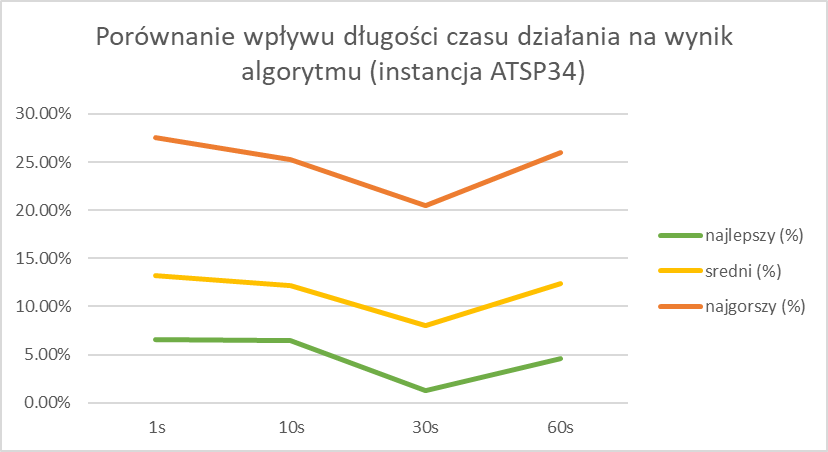
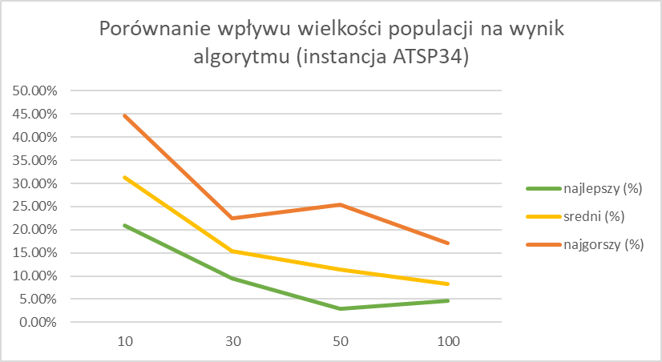
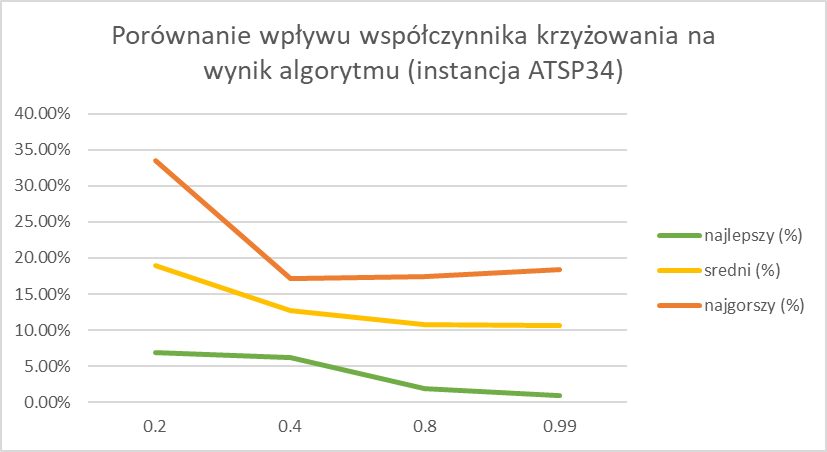
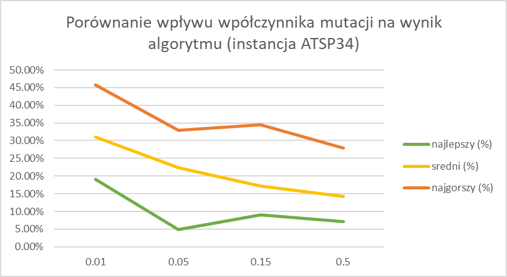
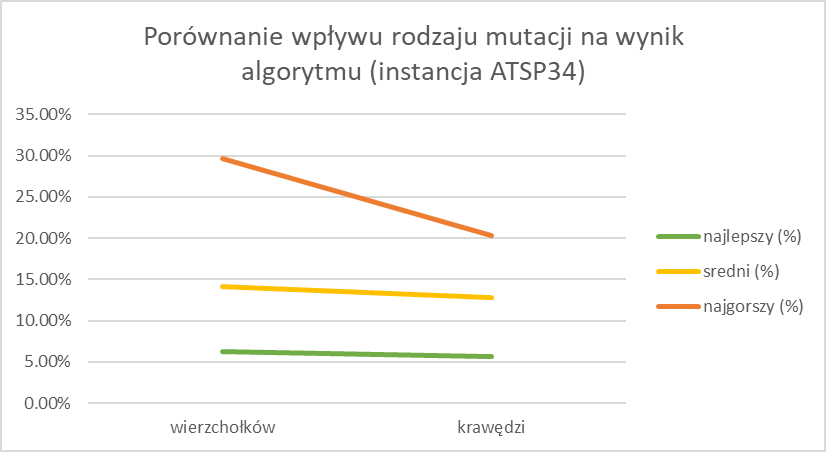
##### Instancja `brazil58` - STSP58
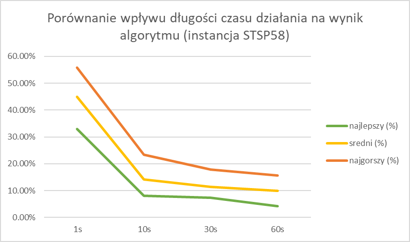
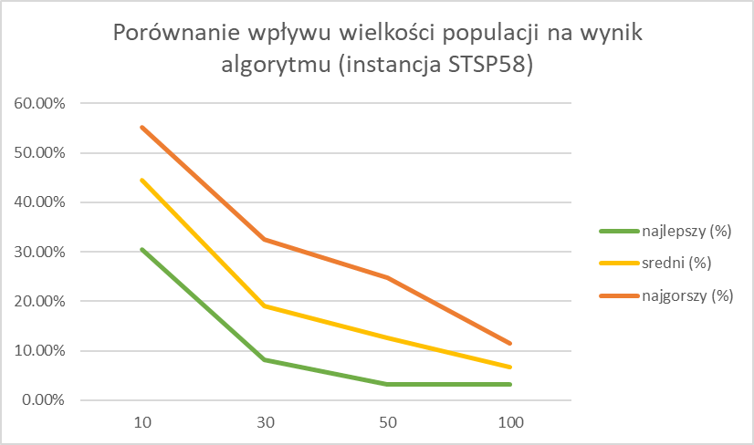
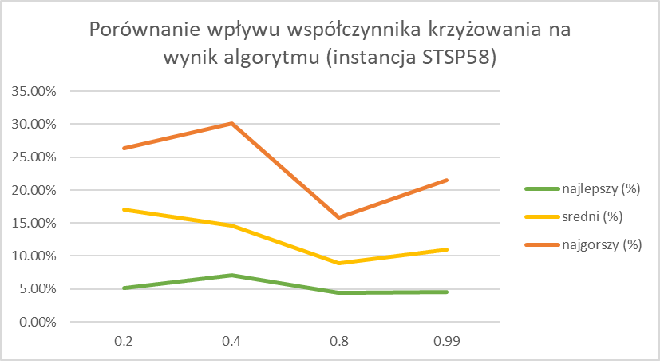
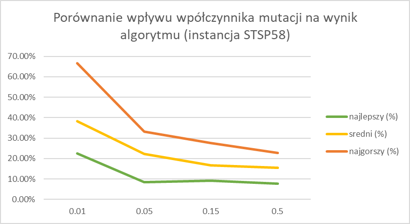
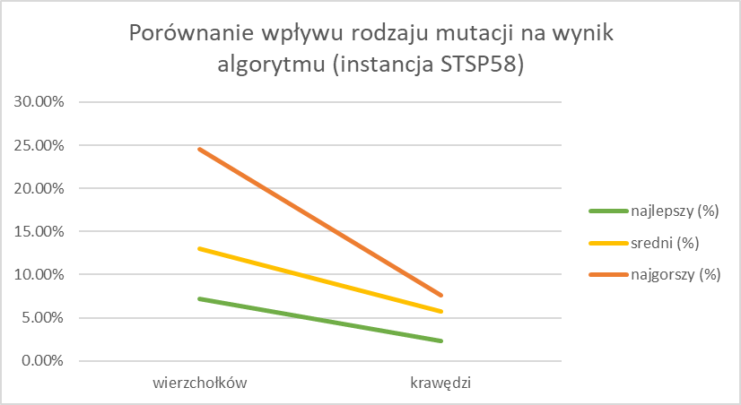
##### Instancja `ftv170` - ATSP171
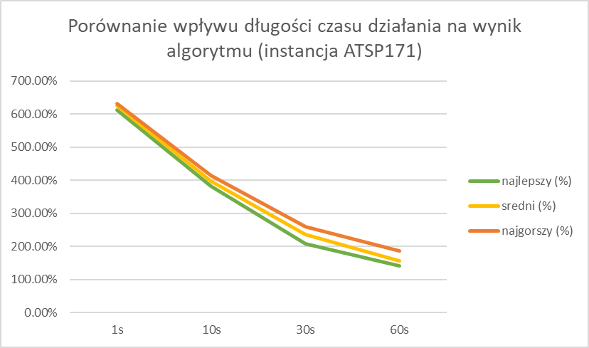
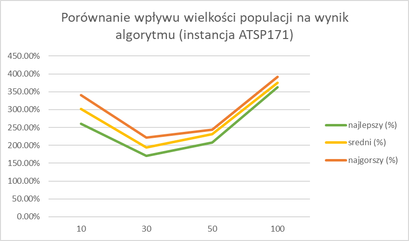
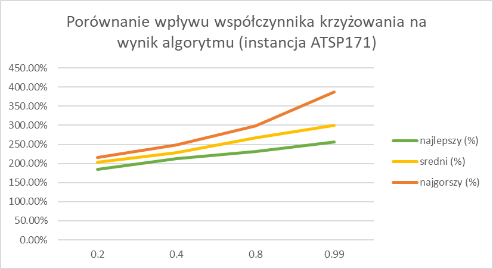
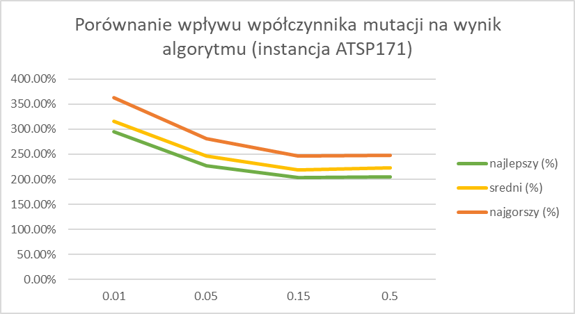
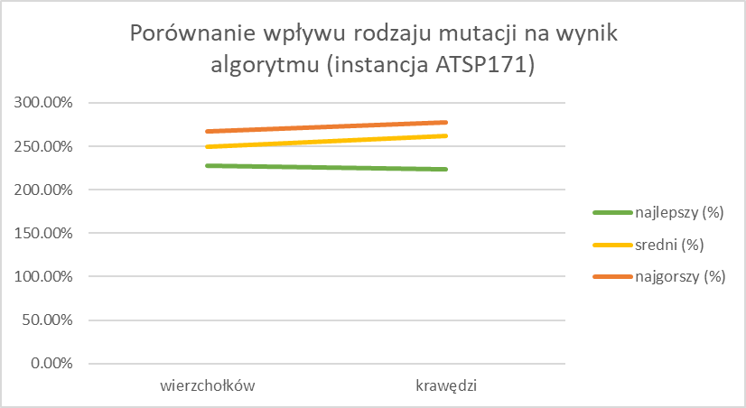
##### Instancja `rbg443` - ATSP443
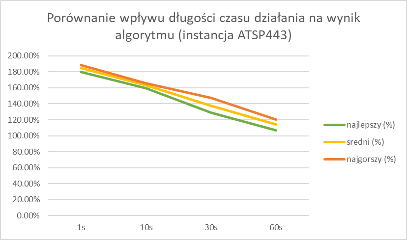
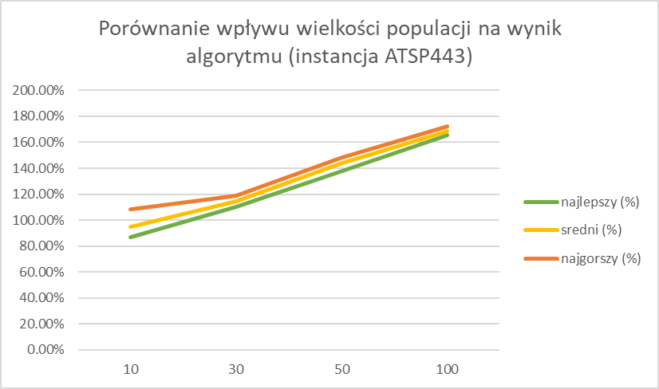
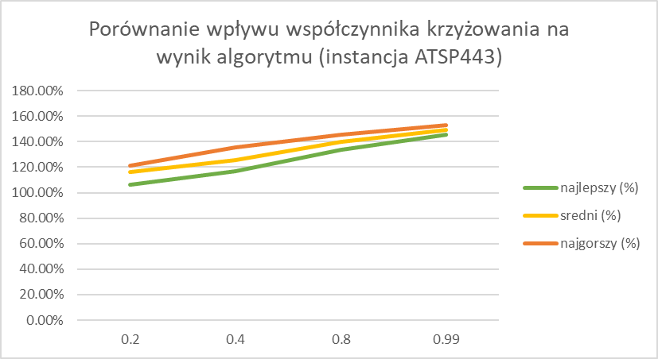
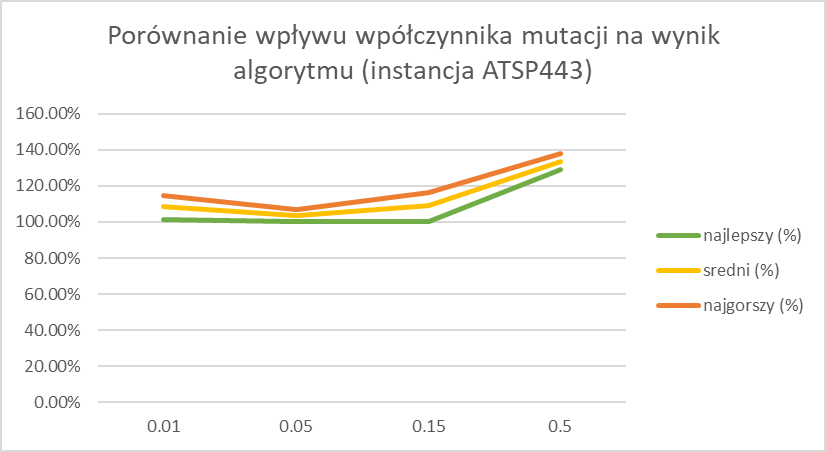
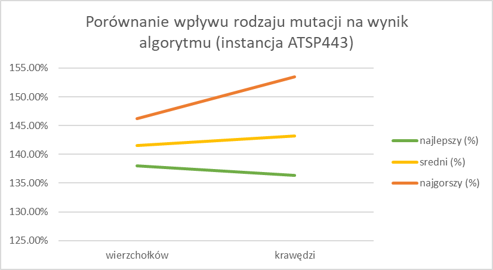
#### Genetic vs Tabu Search
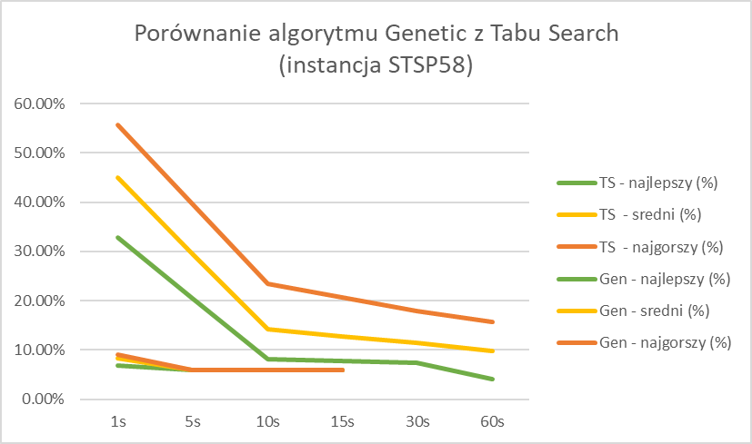
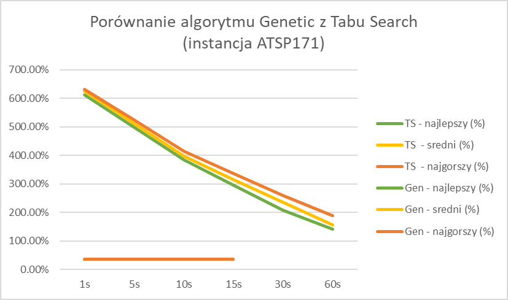
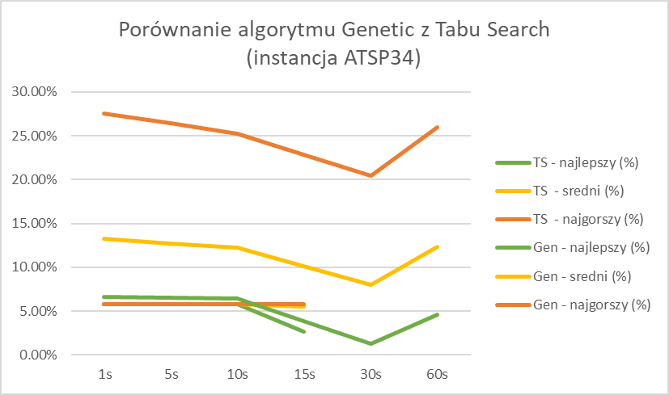
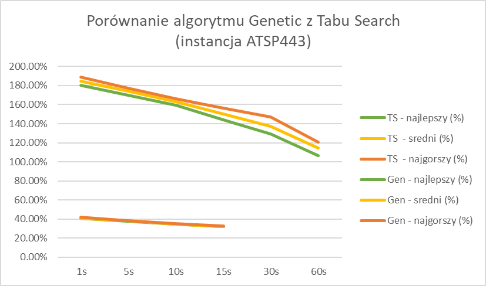
### Wnioski
