# Projektowanie efektywnych algorytmów
## Zadanie projektowe nr 2: Algorytm poszukiwania lokalnego

| Autor | Prowadzący | Termin |
| :-: | :-: | :-: |
| Bartosz Rodziewicz (226105) | Mgr inż. Radosław Idzikowski | Piątek, 7:30 |

### Opis problemu
Wybranym prze mnie problemem optymalizacyjnym jest Travelling Salesman Problem, czyli Problem Komiwojażera.

Polega on na znalezieniu minimalnego cyklu Hamiltona w pełnym grafie ważonym. Cykl Hamiltona to taki cykl w grafie, w którym każdy wierzchołek grafu odwiedzany jest dokładnie raz (plus powrót do wierzchołka początkowego).

Jest to problem NP-trudny.

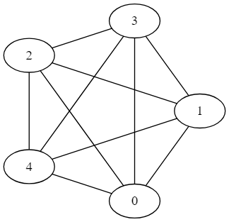

Powyżej znajduje się przykładowy graf dla 5-ciu miast. Każda krawędź posiada wagę, różną dla przejść w jedną i drugą stronę.

W programie graf jest reprezentowany jako macierz `n`x`n` z wagami przejść, gdzie `n` oznacza liczbę miast.

### Metoda rozwiązania
#### Algorytmy Brute Force i Branch and Bound
W sprawozdaniu z etapu 1 dokładnie opisałem działanie i moją implementację powyższych algorytmów, więc nie będę tutaj tego powtarzać.

Są to algorytmy dokładne, więc zawsze znajdą najbardziej optymalny wynik, jednak posiadają bardzo dużą złożoność obliczeniową (w obu przypadkach `O(n!)`).

#### Algorytm Tabu Search
Wybranym przeze mnie algorytmem przeszukiwania lokalnego jest algorytm Tabu Search, czyli przeszukiwanie z zakazami.

Algorytm ten, jest tak na prawdę ideą i jego implementacje mogą znacząco się różnić od siebie.

Główny zarys tego algorytmu wygląda następująco:
* Algorytm wyznacza w jakiś sposób początkowe rozwiązanie,
* Algorytm przeszukuje otoczenie tego rozwiązania (otoczeniem jest zbiór innych rozwiązań różniących się od obecnego rozwiązanie o jeden Ruch; Ruch, jak i otoczenie definiowane jest poprzez implementacje),
* Z pośród wszystkich rozwiązań w danym otoczeniu algorytm wybiera najlepsze i Ruch dodawany jest do listy zabronionych ruchów na jakiś okres kadencji (czas, bądź liczba iteracji),
* Algorytm kończy pracę, gdy nastąpi spełnienie warunku satysfakcjonującego (czas, bądź liczba iteracji), zwraca wtedy najlepsze dotąd znalezione rozwiązanie.

Algorytm w żaden sposób nie gwarantuje znalezienie najbardziej optymalnego rozwiązania, jednak znacząco skraca czas wyznaczania w miarę optymalnego rozwiązania (użytkownik decyduje ile czasu algorytm pracuje).

Jeśli dla danej instancji problemu nie jest znane rozwiązanie optymalne, nie ma też żadnej możliwości aby oszacować stopnia błędu znalezionego przez algorytm rozwiązania.

Lista tabu służy zabezpieczeniu algorytmu przed zablokowaniem się w okolicy jednego lokalnego optimum.

Celem zwiększenia szansy znalezienia globalnego optimum w algorytmie stosuje się różne metody dywersyfikacji poszukiwań.

Moja implementacja bazuje na następujących cechach:
* Początkowe rozwiązanie znajdywane jest za pomocą zachłannego algorytmu najbliższego sąsiada (nearest neighbor algorithm). _Statystycznie algorytm ten znajduje rozwiązanie o 25% dłuższe niż najlepsze rozwiązanie przy całkowicie losowym rozłożeniu miast._
* Ruchem w moim algorytmie jest wymiana dwóch miast ze sobą w trasie (algorytm zakłada spójność grafu (asymetryczność jest dozwolona)).
* Otoczeniem rozwiązania (otoczenie typu swap) jest więc każde rozwiązanie różniące się od obecnego pozycją dwóch miast (złożoność obliczeniowa jednej iteracji to `O(n^2)`).
* Na liście tabu przechowywane są pary wierzchołków zakazując ich ponownej wymiany przez ustaloną przez użytkownika ilość iteracji (domyślnie `0.5 * ilośćWierzchołków`).
* Zaimplementowane kryterium aspiracji (opcjonalne, domyślnie włączone) pozwala na wykonanie ruchu znajdujące się na liście tabu jeśli prowadzi ono do poprawienia najlepszego rozwiązania dotychczas znalezionego.
* Strategią dywersyfikacji (opcjonalną, domyślnie włączoną) jest wyznaczenie nowego, całkowicie losowego, rozwiązania po określonej liczbie iteracji (domyślnie 10 tys.) bez poprawy najlepszego znalezionego rozwiązania.
* Kryterium satysfakcji jest czas pracy algorytmu po którym następuje przerwanie pracy algorytmu (domyślnie 10(s)). _Czas pracy algorytmu sprawdzany jest po każdym przeszukaniu sąsiedztwa, więc nie jest całkowicie dokładny. Średnio algorytm wykonuje się 10% dłużej niż podany przez użytkownika czas._

Ponieważ algorytm oparty na metodzie Tabu Search jest algorytmem niedeterministycznym, nie można dla niego w całości określić czasowej złożoności obliczeniowej. Można jednak podać złożoność obliczeniową pojedynczego przeglądu całego sąsiedztwa, która dla sąsiedztwa typu swap
wynosi `O(n^2)`.

### Metoda testowania i plan eksperymentu
Wykonane przeze mnie testy można podzielić na dwa etapy.

Pierwszym było porównanie algorytmu Tabu Search do algorytmu Branch and Bound. Porównanie to polegało na porównaniu czasu pracy dla 7 gotowych instancji ze strony prowadzącego i najkrótszego wywołania algorytmu Tabu Search. Z powodu błędu w mojej implementacji algorytmu Tabu Search nie jest możliwe wywołanie algorytmu na czas krótszy niż 1s.

Drugim był właściwy test wpływu różnych parametrów Tabu Search na jego dokładność przy czterech instancjach problemu o różnych rozmiarach.

Za każdym razem testowany był jeden parametr zostawiając inne na ustawieniu domyślnym.

Po kolei testowane były następujące parametry:
* Czas obecności elementów na liście tabu: [0.25\*n, 0.5\*n, n, 2\*n], gdzie n to ilość miast w danej instancji
* Czas pracy algorytmu: [1s, 5s, 10s, 15s]
* Kryterium aspiracji: [tak, nie]
* Kryterium dywersyfikacji: [tak, nie]
* Ilość iteracji do zmiany otoczenia dla dywersyfikacji: [1 tys, 5 tys, 10 tys, 15 tys]

Każdy parametr był testowany 10-cio krotnie i analizowane są znalezione wyniki. Na wykresie przedstawiona jest wartość błędu względnego znalezionego rozwiązania od rozwiązania optymalnego. Zamieszczone są trzy wartości - wartość błędu najgorszej wartości, średniej i najlepszej znalezionej w tych 10-ciu wywołaniach algorytmu.

Wybrane do testu instancje problemu to:
* `ftv33` - 34 miasta, instancja asymetryczna, trasa optymalna: 1286
* `brazil58` - 58 miasta, instancja symetryczna, trasa optymalna: 25395
* `ftv170` - 171 miasta, instancja asymetryczna, trasa optymalna: 2755
* `rbg443` - 443 miasta, instancja asymetryczna, trasa optymalna: 2720

Pomiar czasu wykonywany był za pomocą `std::chrono::high_resolution_clock`, dostępnego w bibliotece standardowej C++11.

**Wyniki pomiarów podane są w mikrosekundach, chyba że zaznaczone inaczej.**

### Wyniki pomiarów
#### Tabu Search vs Branch and Bound
Jako pierwszy test uruchomiłem oba algorytmy dla wszystkich 7 małych instancji, jedna po drugiej. Tabu Search ustawiłem na najkrótsze wykonanie, na jakie pozwoliła mi moja implementacja (okazuje się, że jest to 1s). W takiej konfiguracji Tabu Search znalazł optymalne wyniki, jednak wykonywał się około 50 razy dłużej niż Branch and Bound.

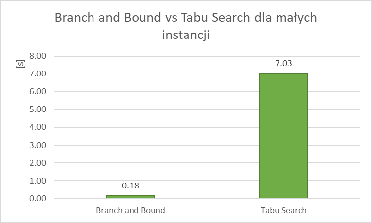

#### Wpływ parametrów algorytmu na jego dokładność
##### Instancja `ftv33` - ATSP34
Pierwszym testowanym parametrem była ilość iteracji obecności na liście tabu. Domyślną wybraną przeze mnie wartością jest `0.5 * n`, jednak test pokazuje, że nie do końca tak musi być. Co prawda wartość średnia utrzymuje się podobnie dla `0.5*n` i `n`, jednak najlepszy znaleziony wynik był dla długości `n`.

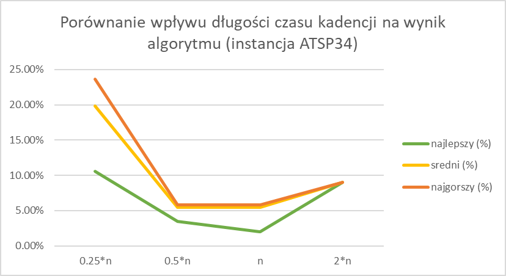

Kolejnym testowanym parametrem była długość pracy algorytmu. Wykres pokazuje, że dla tak małej instancji nie ma on za dużego wpływu, już przy bardzo krótkim wywołaniu algorytm znajduje bardzo optymalny wynik (błąd względny na poziomie 6%), a znalezienie bardziej dokładnego czasu wymagałoby sporo dłuższej pracy algorytmu. Zakrzywienie dla 15s wynika z jednorazowego "szczęścia" z uwagi na kryterium dywersyfikacji.

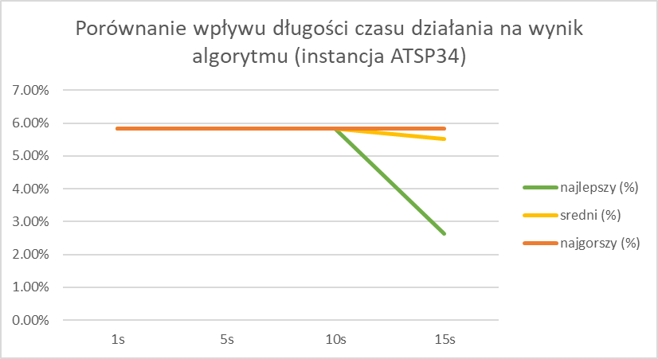

Kolejny parametr jest chyba najbardziej oczywistym i jego testowanie nie było konieczne. Zaimplementowane przeze mnie kryterium aspiracji pozwalające na zakazany ruch tylko, gdy poprawia on najlepsze dotychczasowe rozwiązanie jest bardzo restrykcyjnym kryterium, które nie może pogorszyć w żaden sposób wyniku. Ilość obliczeń troszkę się zwiększa, jednak jak pokazuje poniższy test wpływa ono pozytywnie na ogólną pracę algorytmu.

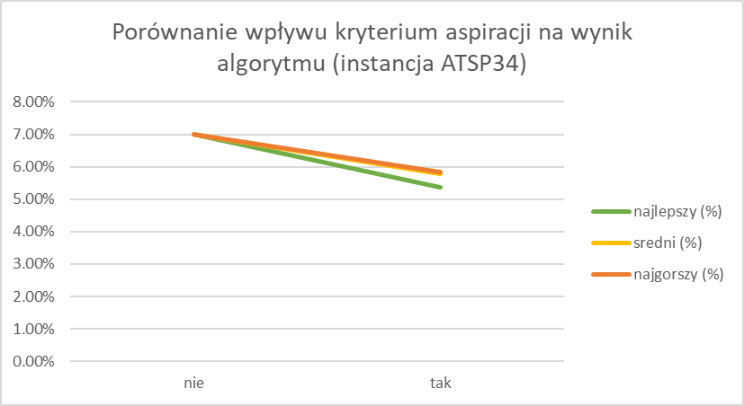

Ciekawym wynikiem, który nie do końca jestem w stanie wyjaśnić jest wpływ kryterium dywersyfikacji na pracę algorytmu. Wydaje mi się, że jest to związane z tym, że wynik, który algorytm zwracał najczęściej (droga długości 1361), znajduje się w sąsiedztwie rozwiązania początkowego, a wybrane przeze mnie kryterium dywersyfikacji (losowe rozwiązania) jest mocno zależne od szczęścia i najczęściej zwraca gorsze rozwiązania z nieciekawym otoczeniem. Jest to kwestia, którą mógłbym rozwiązań lepiej.

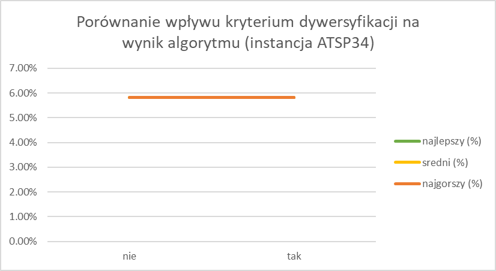

Ostatnim testowanym przeze mnie parametrem jest ilość iteracji do zmiany otoczenia i wynik pokazuje, że wybrana przeze mnie wartość domyślna jest optymalna. Dzięki obecności dywersyfikacji, w tym teście jedno z wykonań algorytmu zwróciło wynik o błędzie lekko powyżej 1%.

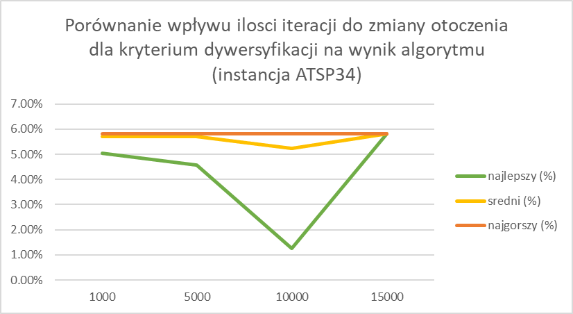

##### Instancja `brazil58` - STSP58
Wyniki w przypadku tej instancji mocno pokrywają się z poprzednią. Również zauważamy tendencję przy długości listy tabu i widzimy, że długość n wypada najlepiej. Z uwagi, że jest to większa instancja czas zaczyna odgrywać tu większą rolę i 1s wykonanie algorytmu zwraca znacząco gorsze wyniki niż dłuższe wykonania. Inne parametry mają znikomy wpływ.

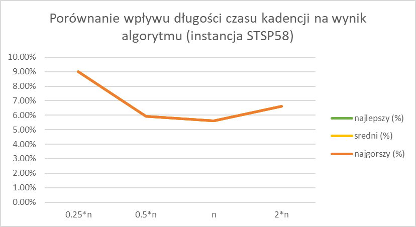
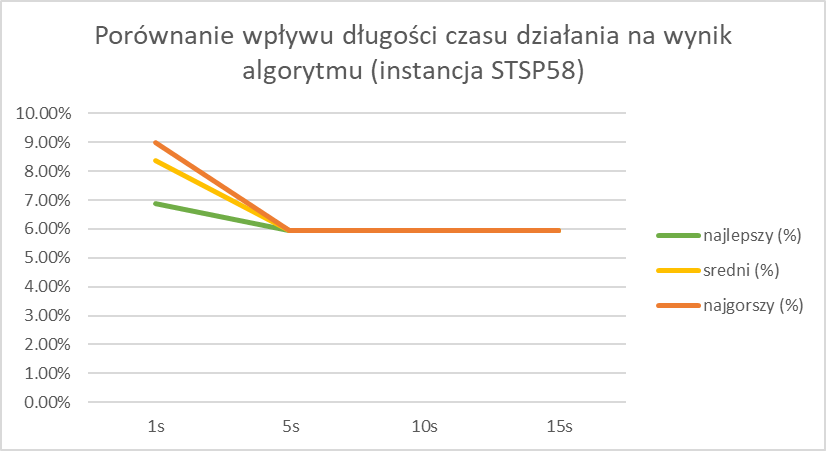
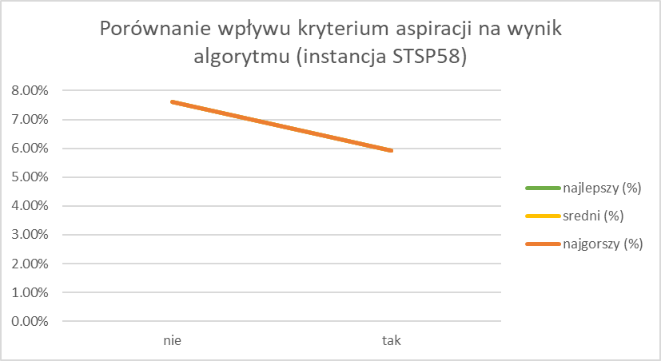
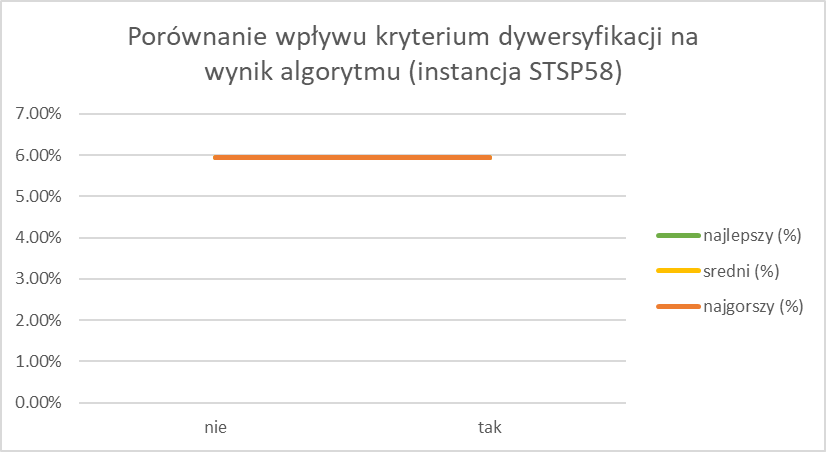
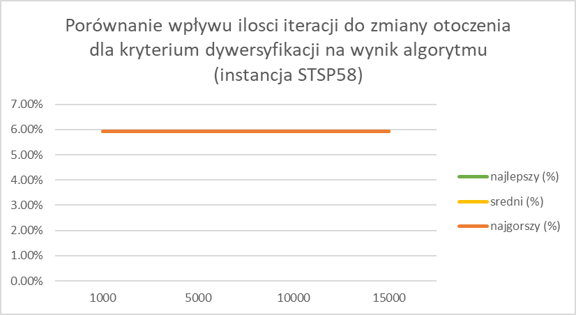

##### Instancja `ftv170` - ATSP171
Ten test mógłbym całkowicie pominąć, ponieważ każdy test zwrócił jeden, tak samo niedokładny (aż 37% błędu) wynik. Po przejrzeniu tych wyników bardzo mnie one zaciekawiły i okazało się, że ten zwracany wynik znajduje się w bliskim otoczeniu rozwiązania początkowego. Dodatkowo z uwagi na już dość spory rozmiar problemu algorytm nie jest w stanie niczego ciekawego znaleźć w tak krótkim czasie. Jednak już zwiększenie czasu do 30s powoduje spadek błędu do okolic 30%.

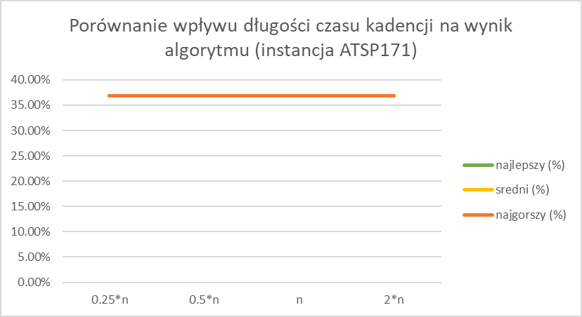
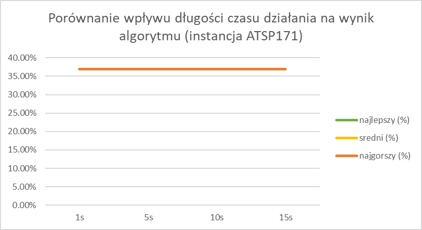
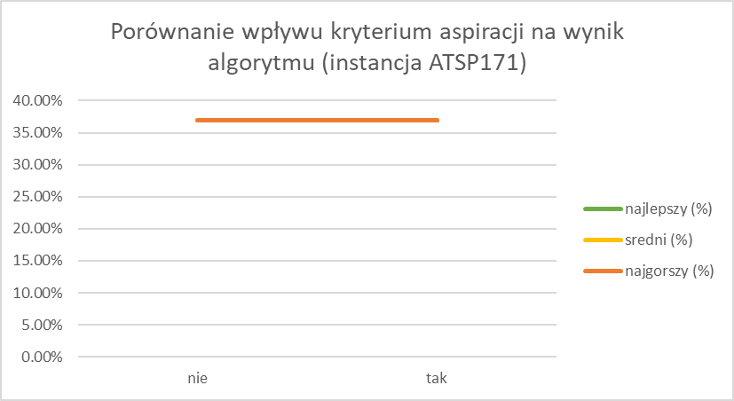
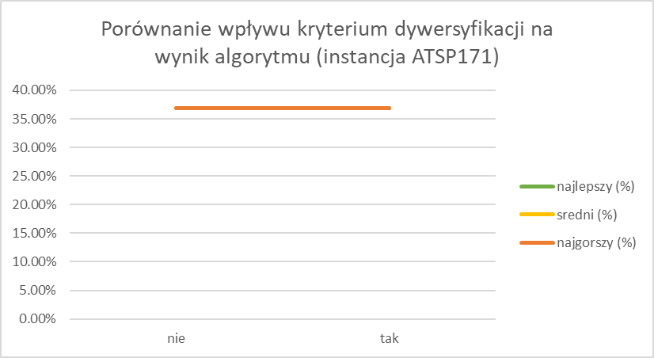
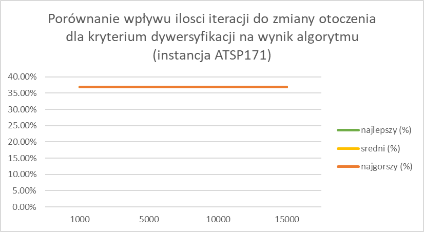

##### Instancja `rbg443` - ATSP443
Dla tej instancji wyniki też nie są zbyt ciekawe i mógłbym je pominąć poza jednym. Jest nim drugi wykres, czyli czas pracy algorytmu, który bardzo ładnie pokazuje, że zwiększając czas poprawia się znalezione rozwiązanie, a przy tak sporej instancji problemu ma to już duże znaczenie.

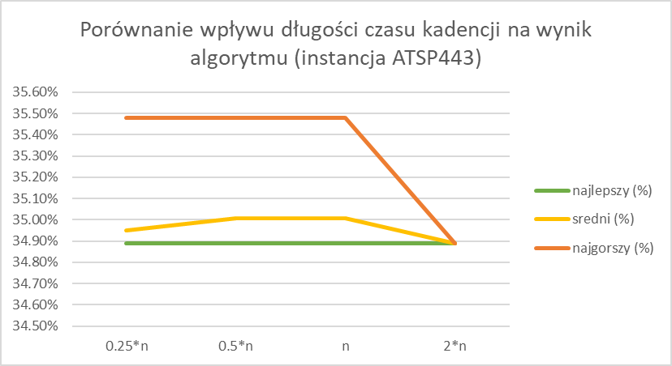
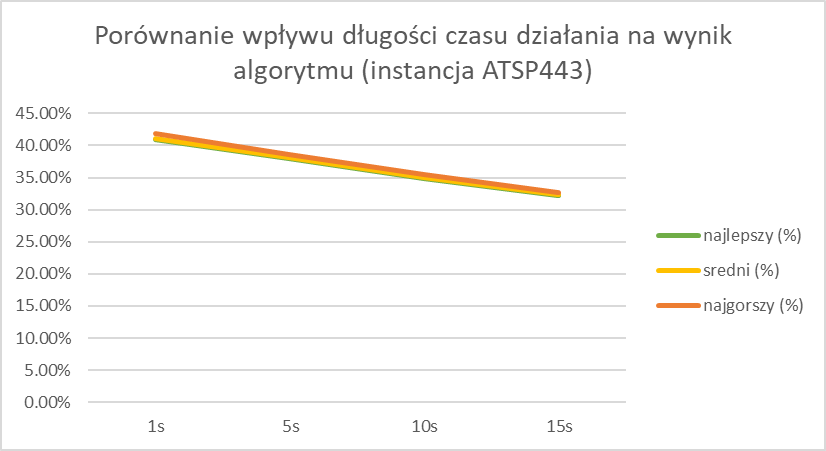
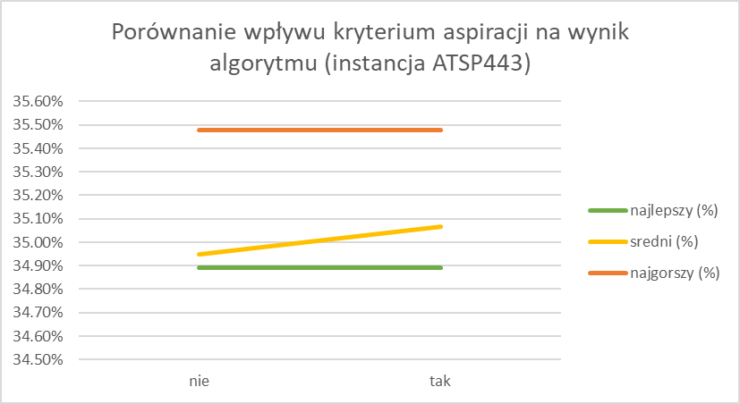
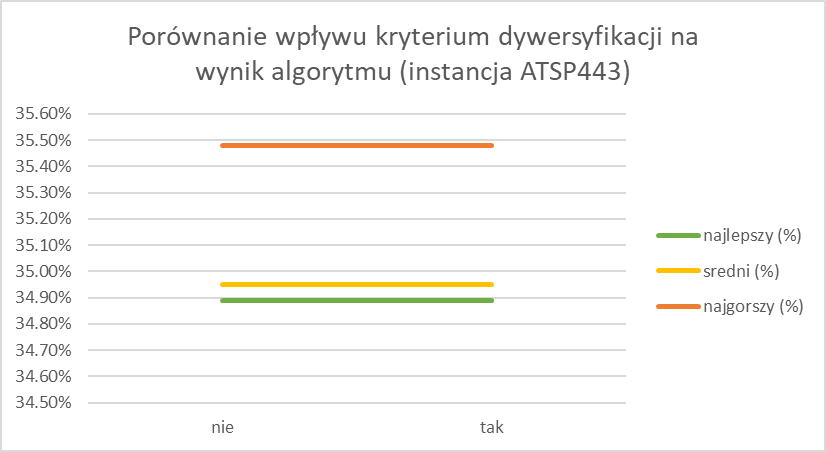
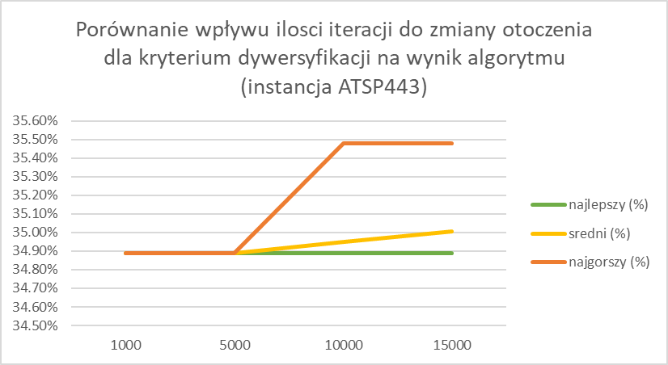

### Wnioski
* Gdy rozpoczynałem pracę nad tym algorytmem długość listy tabu/czas obecności elementu na niej wydawał mi się bardzo mało istotnym parametrem tego algorytmu. Testy pokazały jednak, że (zaraz po czasie) jest on drugim najistotniejszym parametrem w mojej implementacji.
* Zaimplementowane przeze mnie kryterium dywersyfikacji, wydaje się być zbyt losowe, przez co nie poprawia znacząco wyniku algorytmu.
* Zaimplementowane przeze mnie kryterium aspiracji jest mocno rygorystyczne, przez co nie ma dużego wpływu na wynik algorytmu.
* Gdy używany rozważnie (czas pracy dobrany do instancji) algorytm Tabu Search pozwala znaleźć bardzo dobre wyniki w relatywnie krótkim czasie.
