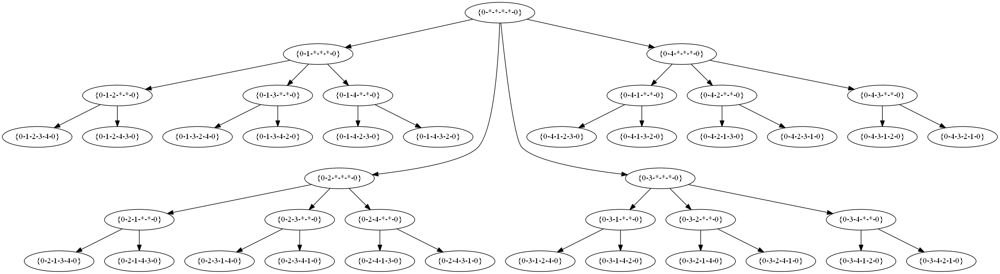
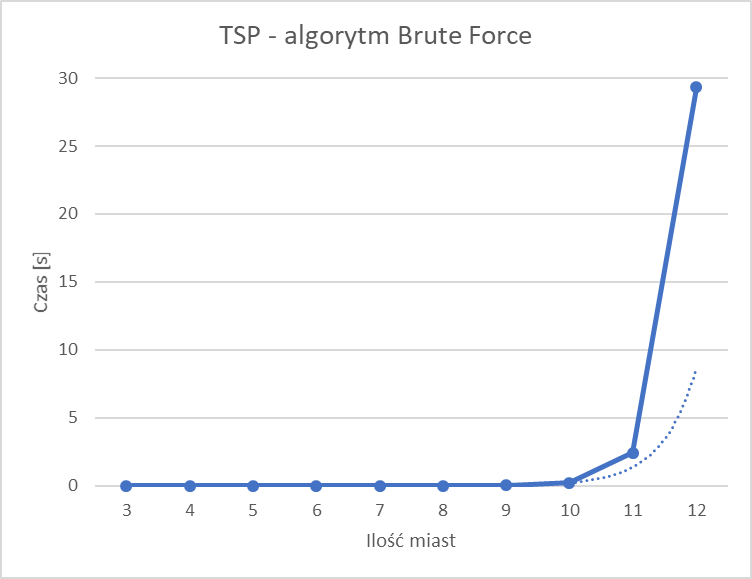
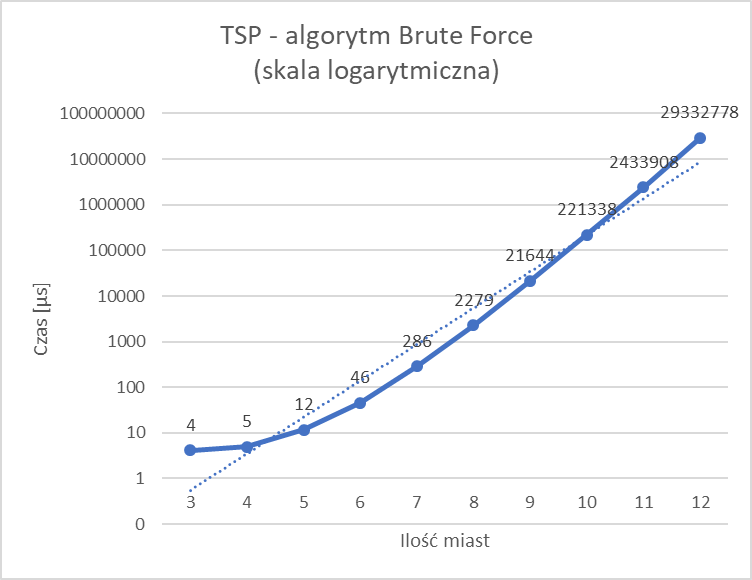
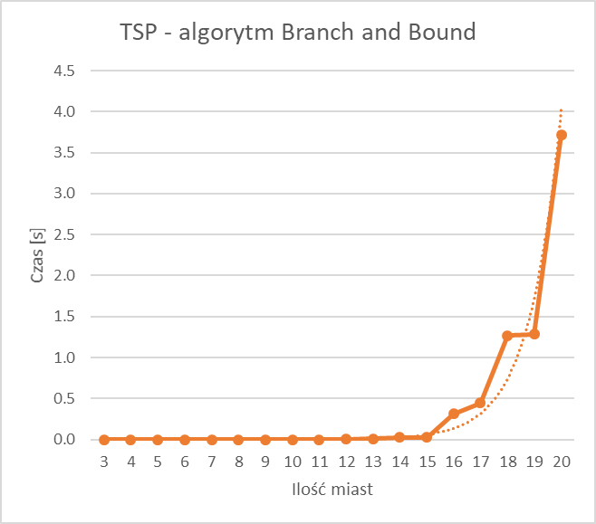
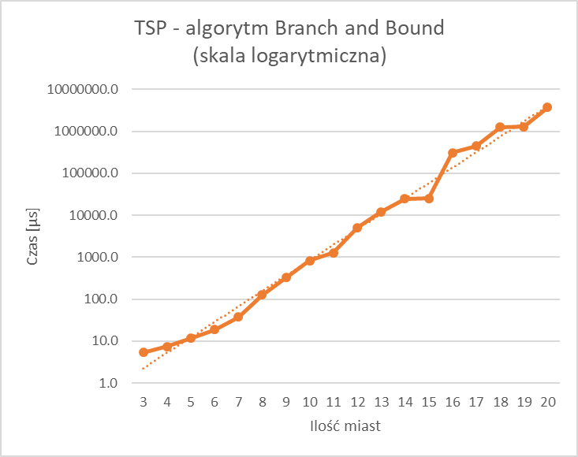
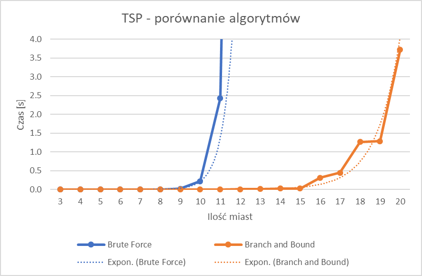
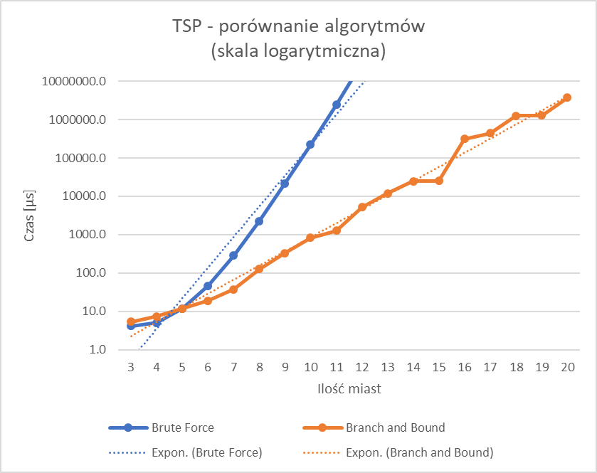

# Projektowanie efektywnych algorytmów
## Zadanie projektowe nr 1: Algorytm dokładny

| Autor | Prowadzący | Termin |
| :-: | :-: | :-: |
| Bartosz Rodziewicz (226105) | Mgr inż. Radosław Idzikowski | Piątek, 7:30 |

### Opis problemu
Wybranym prze mnie problemem optymalizacyjnym jest Travelling Salesman Problem, czyli Problem Komiwojażera.

Polega on na znalezieniu minimalnego cyklu Hamiltona w pełnym grafie ważonym. Cykl Hamiltona to taki cykl w grafie, w którym każdy wierzchołek grafu odwiedzany jest dokładnie raz (plus powrót do wierzchołka początkowego).

Jest to problem NP-trudny.

  
Powyżej znajduje się przykładowy graf dla 5-ciu miast. Każda krawędź posiada wagę, różną dla przejść w jedną i drugą stronę.

W programie graf jest reprezentowany jako macierz `n`x`n` z wagami przejść, gdzie `n` oznacza liczbę miast.

### Metoda rozwiązania
#### Algorytm Brute Force
Pierwszym zaimplementowanym przeze mnie algorytmem dokładnym jest algorytm Brute Force, czyli przegląd zupełny.

Polega on na policzeniu każdego możliwego rozwiązania i sprawdzeniu, które jest najlepsze. Ilość permutacji w grafie nieskierowanym to `(n-1)!`, co powoduje, że złożoność obliczeniowa tego algorytmu to `O(n!)`.

Implementacja jego polega na rekurencyjnym przechodzeniu drzewa rozwiązań.

  
Przykładowe drzewo rozwiązań dla 5 miast. Wymaga sprawdzenia 24 permutacji.

#### Algorytm Branch and Bound
Drugim algorytmem jest Branch and Bound, czyli algorytm podziału i ograniczeń.

Tak samo jak Brute Force przechodzi rekurencyjnie przez drzewo rozwiązań, jednak nie robi tego całkowicie na ślepo.

Znajdując się na każdym wierzchołku drzewa rozwiązań algorytm wylicza najlepszy wynik jaki uzyska sprawdzając poddrzewa każdego ze swoich potomków. Uwzględniana jest aktualna długość trasy od wierzchołka startowego, wynik funkcji liczącej dolne ograniczenie oraz najlepsze znalezione do teraz rozwiązanie.

W całym algorytmie najważniejsza jest funkcja licząca dolną granicę. Zależy ona bezpośrednio od specyfiki problemu i jej dokładność wpływa na czas obliczeń.

W moim rozwiązaniu funkcja ta jest połączona z minimalnym kosztem odwiedzenia każdego wierzchołka.

Możemy zauważyć, że do każdego wierzchołka wchodzi i wychodzi się dokładnie raz, dlatego:
* dla każdej krawędzi połowę jej wagi skojarzamy z wierzchołkiem z którego wychodzi, a drugą połowę z wierzchołkiem do którego wchodzi
* dlatego dla każdego wierzchołka obliczamy minimalny koszt jego odwiedzenia jako sumę połowy minimalnych kosztów wejścia i wyjścia z niego

Na początku działania algorytmu liczymy dolne ograniczenie jako sumę minimalnych kosztów odwiedzenia każdego wierzchołka, czyli `( min(wagaKrawedziWchodzacej) + min(wagaKrawedziWychodzacej) ) / 2`. Zaczynamy też liczyć koszt już przebytej trasy.

Przy analizie potomków wierzchołka, na którym się znajdujemy do przebytej trasy dodajemy drogę do tego potomka, a z dolnego ograniczenia odejmujemy połowę minimalnego kosztu wyjścia z wierzchołka, w którym jesteśmy i połowę minimalnego kosztu wejścia do wierzchołka będącego potomkiem. Następnie sumę aktualnie przebytej trasy i dolnego ograniczenia porównujemy z najlepszym znalezionym rozwiązaniem. Jeśli aktualnie znalezione rozwiązanie jest lepsze od przewidywanego najlepszego jakie można osiągnąć idąc tą gałęzią, gałąź "odcinamy" i bez sprawdzania jej przechodzimy do sprawdzenia kolejnego potomka.

Takie odcinanie gałęzi powoduje spore zaoszczędzenie obliczeń w wielu przypadkach.

Nigdy nie mamy jednak gwarancji, że uda nam się ominąć sporo tych poddrzew i w najgorszym przypadku algorytm ten może zdegradować się do przeglądu zupełnego.

Złożoność obliczeniowa tego algorytmu to również `O(n!)`.

Nie jest to też najlepsza istniejąca metoda szacowania dolnego ograniczenia i mimo, że skraca wyniki, nie jest w tym bardzo dobra. Na moim komputerze pozwoliła mi liczyć grafy 20-paro elementowe w czasie kilku minut, gdzie Brute Force taki czas miał dla 13 miast.

### Metoda testowania i plan eksperymentu
Test polegał na zmierzeniu czasu w jakim algorytm znajdywał rozwiązanie dla konkretnej ilości miast.

Dla algorytmu Brute Force był to przedział [3, 12]. Dla Branch and Bound [3, 20].

Dla każdej ilości miast pomiar wykonywany był 10-cio krotnie. Przy liczeniu średniej i generowaniu wykresów jeden największy i najmniejszy wynik był odrzucany, aby dane były bardziej spójne.

Pomiar czasu wykonywany był za pomocą `std::chrono::high_resolution_clock`, dostępnego w bibliotece standardowej C++11.

Przed każdym uruchomieniem algorytmu generowany był nowy graf, z losowymi wagami całkowitymi z przedziału [1, 30].

**Wyniki pomiarów podane są w mikrosekundach, chyba że zaznaczone inaczej.**

### Wyniki testów
Wszystkie wyniki znajdują się na końcu dokumentu.

#### Brute Force

Wyniki pomiarów potwierdzają złożoność logarytmiczną. Lekkie zakrzywienie na dole zdaje się tłumaczyć większym wpływem możliwego chwilowego obciążenia komputera na tak małe czasy.

#### Branch and Bound

Wyniki pomiarów potwierdzają złożoność logarytmiczną. O wiele większe nierówności wynikają z faktu, że przy losowych instancjach problemu nie możemy oszacować ile permutacji, będzie musiał algorytm sprawdzić. Te wyniki są również o wiele bardziej nie równe względem siebie dla takiej samej liczby miast.

#### Porównanie algorytmów

Na powyższych wykresach widać, że algorytm Branch and Bound zaczyna osiągać lepsze wyniki już przy 6 miastach. Przy mniejszej liczbie czas dodatkowych obliczeń jest większy niż zysk ze zmniejszonego drzewa do sprawdzenia. Widać też, że mimo iż w przypadku Podziału i Ograniczeń złożoność czasu również jest logarytmiczna, wzrasta ona w sposób o wiele wolniejszych.

### Wnioski
* Przegląd zupełny jest algorytmem całkowicie nie efektywnym. Nawet najprostsze implementacje Branch and Bound potrafią zmniejszyć czas obliczeń, takie jak sprawdzenie czy droga do aktualnego wierzchołka nie jest dłuższa od najlepszej znalezionej (nie wymaga żadnych dodatkowych obliczeń), czy wybrana przeze mnie metoda, sprawdzająca najmniejszy koszt wierzchołków.
* Warto zaimplementować w algorytmie metodę przerwania pracy po przekroczeniu danego czasu. W przypadku algorytmu Podziału i Ograniczeń, mimo przerwania, dostajemy przedział w jakim znajduje się nasz wynik [dolne ograniczenie, najlepsze rozwiązanie znalezione do momentu przerwania].
